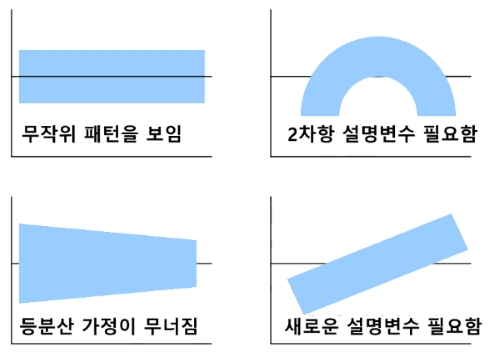
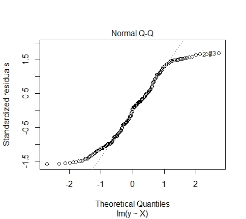

### 1절. 회귀분석 개념

#### 1. 회귀분석

: 원인(독립변수)이 결과(종속변수)에 미치는 영향 추정

#### 2. 선형회귀분석의 가정

-   독립변수와 종속변수 간의 선형성

-   오차의 등분산성

-   오차의 독립성

-   오차의 정규성

#### 3. 그래프를 활용한 선형회귀분석의 가정 검토

1.  선형성

{width="333"}

2.  등분산성

{width="421"}

3.  정규성

{width="444"}

### 2절. 단순 선형회귀분석

#### 1. 단순 선형회귀분석(단변량 회귀분석)

$$
Y_i = \beta_0 + \beta_1 x_i + \epsilon_i
$$

#### 2. 회귀분석 시 검토사항

1.  모형 내의 회귀계수가 유의한가?
2.  모형은 데이터를 얼마나 설명할 수 있는가?
3.  회귀모형은 통계적으로 유의한가?
4.  모형의 데이터를 잘 적합하고 있는가?

#### 3. R을 이용한 단순선형회귀분석

-   lm()

```{r}
library(MASS)
data("Cars93")
str(Cars93)

Cars93_lm <- lm(Price~EngineSize, Cars93)
Cars93_lm

summary(Cars93_lm)
```

1.  회귀모형의 포뮬러 : lm(y\~x)
2.  회귀계수 : Coefficients
3.  모형의 설명력 : Adjusted R-squared
4.  모형의 통계적 유의성 : F-statistics

#### 4. R을 이용한 선형회귀모형 진단

```{r}
plot(Cars93_lm, which = c(1:6))
```

1.  Residuals vs Fitted : 오차의 정규성 가정 =\> 오차의 분포는 기울기가 0인 직선
2.  Normal Q-Q : 오차의 정규성 가정 =\> 그래프의 점들은 45도 각도의 직선 형태
3.  Scale-Location : (1번과 동일)
4.  Cook's distance : 한 관측치가 회귀모형에 미치는 영향을 나타내는 측도, 1 이상일 경우 매우 큰 영향을 주는 관측값
5.  Residuals vs Leverage : 설명변수가 얼마나 극단에 치우쳐 있는지, 0.5이상인 점은 예측치를 크게 벗어난 관측값
6.  Cook's dist vs Leverage : 레버리지와 쿡의 거리는 비례하는 관계

#### 5. 선형회귀모형을 활용한 예측

-   predict.lm

```{r}
Cars93_lm

set.seed(1234)
idx <- sample(1:nrow(Cars93),5)
idx

test <- Cars93[idx,]

# 점추정
predict.lm(Cars93_lm, test, interval = 'none')

# 회귀계수의 불확실성을 감안한 구간추정
predict.lm(Cars93_lm, test, interval = 'confidence')

# 회귀계수의 불확실성과 오차항을 감안한 구간추정
predict.lm(Cars93_lm, test, interval = 'prediction')
```

### 3절. 다중선형회귀분석

#### 1. 다중선형회귀분석(다변량 회귀분석)

$$
Y = \beta_0 + \beta_1 x_1 + \beta_2 x_2 + \cdots + \beta_k x_k +\epsilon
$$

#### 2. 다중선형회귀분석 시 검토사항

1.  데이터가 전제하는 가정을 만족시키는가?
2.  모형 내의 회귀계수가 유의한가?
3.  모형은 데이터를 얼마나 설명할 수 있는가?
4.  회귀모형은 통계적으로 유의한가?
5.  모형이 데이터를 잘 적합하고 있는가?
6.  다중공선성

#### 3. 더미변수(dummy variable)

-   범주형 변수 변환 - 기준이 되는 범주를 제외한 n-1개의 변수 생성

-   lm함수의 범주형 변수 처리 - 자동 변환

```{r}
data("iris")
iris_lm <- lm(Petal.Length~., iris)
summary(iris_lm)
```

#### 4. R을 이용한 다중선형회귀분석

-   lm()

```{r}
data("Cars93")
str(Cars93)

Price_lm <- lm(Price ~ EngineSize+RPM+Weight, Cars93)
summary(Price_lm)
```

1.  회귀모형의 포뮬러 : y \~ x1 + x2 + ...
2.  회귀계수 : Coefficients
3.  모형의 설명력 : Adjusted R-squared
4.  모형의 통계적 유의성 : F-statistics

#### 5. 최적회귀방정식의 선택

-   단계적 변수 선택

    1.  전진 선택법
    2.  후진 제거법
    3.  단계적 방법

-   벌점화된 선택기준 - AIC or BIC 값이 최소가 되는 모형

    1.  AIC
    2.  BIC

#### 6. R을 이용한 변수선택법

-   p-value 이용

```{r}
data("Cars93")

# 회귀모형
lm_a <- lm(Price~EngineSize+RPM+Width+Length, Cars93)
summary(lm_a)

# 유의확률이 가장 높은 변수 Width 제거 후 회귀모형
lm_b <- lm(Price~EngineSize+RPM+Length, Cars93)
summary(lm_b)

# 유의확률이 가장 높은 변수 Length 제거 후 회귀모형
lm_c <- lm(Price~EngineSize+RPM, Cars93)
summary(lm_c)
```

-   step(object, scope, direction, k)

```{r}
# 후진제거법
lm_result <- lm(Price~EngineSize+Horsepower+RPM+Width+Length, Cars93)
step(lm_result, direction = 'backward')
```

### 추가

#### 1. 정규화 회귀분석(릿지/라쏘 / 엘라스틱넷)

-   glmnet(x, y, alpha) \# glmnet 패키지

    -   alpha : 0=릿지회귀 / 1=라쏘회귀 / 0.5=엘라스틱넷

-   릿지회귀

```{r}
#install.packages('glmnet')
library(glmnet)

library(MASS)
data("Cars93")
head(Cars93)


set.seed(1)
train_idx <- sample(1:nrow(Cars93), replace = F, size = nrow(Cars93)*0.7)

# 표준화
train.x <- scale(Cars93[train_idx,c('EngineSize','RPM','Weight')])
test.x <- scale(Cars93[-train_idx,c('EngineSize','RPM','Weight')])

train.y <- scale(Cars93[train_idx,'Price'])
test.y <- scale(Cars93[-train_idx,'Price'])

# 릿지 회귀분석
ridge.lm <- glmnet(train.x,train.y, alpha=0)
plot(ridge.lm, xvar="lambda")
```

-   cv.glmnet(x,y,alpha)\
    : 교차검증방법으로 적절한 lambda 선정

```{r}
set.seed(1)
cv.ridge <- cv.glmnet(train.x,train.y,alpha=0)
plot(cv.ridge)

# 오차가 제일 작은 값 = 최적의 lambda
(best_lambda <- cv.ridge$lambda.min)
```

-   예측

```{r}
# case 1.
ridge.lm_opt <- glmnet(train.x,train.y, alpha=0, lambda = best_lambda)
pred_y1 <- predict(ridge.lm_opt, newx = test.x)
pred_y1
```

```{r}
# case 2.
pred_y2 <- predict(cv.ridge, newx = test.x, s='lambda.min')

# test Y 역 표준화 후 plot
plot(test.y * attr(test.y, 'scaled:scale') + attr(test.y, 'scaled:center'), ylab = "y")
# 예측값 역 표준화 후 plot
lines(pred_y1 * attr(test.y, 'scaled:scale') + attr(test.y, 'scaled:center'), col="red") 
```

#### 2. 다항식 회귀분석

```{r}
data("quakes")

# 다중회귀분석
lm(mag~lat+long, data=quakes)
```

-   $$
    y = \beta_0 + \beta_1(x_1+x_2)+\epsilon
    $$

```{r}
lm(mag~I(lat+long), data=quakes)
```

-   $$y=\beta_0 + \beta_1 x_1^2+\beta_2 x_2 + \epsilon $$

```{r}
lm(mag~I(lat^2)+long, data = quakes)
```

-   $$y=\beta_0 +\beta_1 x + \beta_2 x^2 + \beta_3 x^3 + \cdots + \epsilon$$

```{r}
lm(mag~lat+I(lat^2)+I(lat^3), data = quakes)
lm(mag~poly(lat, 3, raw = T), data=quakes)
```

#### 3. 곡선 데이터 적합

-   boxcox(object) \# MASS 패키지\
    : 정규분포가 아닌 데이터를 정규분포에 가깝게 만들거나 데이터의 분산을 안정시켜 정상 데이터로 변환

```{r}
x <- 1:100
set.seed(5)
norm <- rnorm(100, 0, 5)
y <- (x+norm)^(-.7)
plot(x, y)
```

```{r}
lm_norm <- lm(y~x)
summary(lm_norm)
```

=\> R\^2 = 0.5335로 설명력이 낮은 것을 알 수 있다.

```{r}
library(MASS)
bc_norm <- boxcox(lm_norm)
lambda <- bc_norm$x[which.max(bc_norm$y)]

plot(x,y^lambda)

summary(lm(y^lambda~x))
```

=\> R\^2=0.9731로 설명력이 아주 높아졌다.

-   로그변환

```{r setup}
pl <- iris$Petal.Length
pw <- iris$Petal.Width
pl_r <- 10^pl
pw_r <- 10^pw
```

1.  log(y) = x

```{r}
plot(pl, pw_r)
```

```{r}
plot(pl, log(pw_r))
summary(lm(log(pw_r) ~ pl))
```

2.  y = log(x)

```{r}
plot(pl_r, pw)
```

```{r}
plot(log(pl_r),pw)
summary(lm(pw ~ I(log(pl_r))))
```

3.  log(y) = log(x)

```{r}
plot(pl_r, pw_r)
```

```{r}
plot(log(pl_r), log(pw_r))
summary(lm(log(pw_r) ~ I(log(pl_r))))
```
