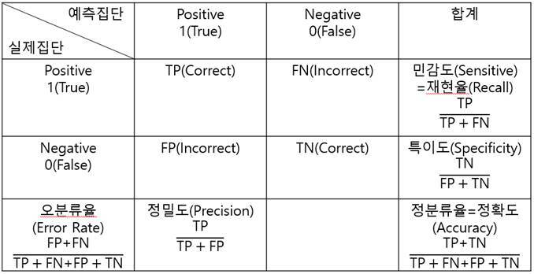

### 1절. 데이터 분할

#### 1. sample

-   sample(x, size, replace=FALSE, prob,...)

```{r}
getwd()
credit.df <- read.csv('./german_credit.csv', header = TRUE)
head(credit.df)
dim(credit.df)

set.seed(1)
idx <- sample(3, nrow(credit.df), replace=T, prob=c(0.5,0.3,0.2))
train <- credit.df[idx==1,]
validation <- credit.df[idx==2,]
test <- credit.df[idx==3,]

nrow(train)
nrow(validation)
nrow(test)
```

#### 2. createDataPartition (caret 패키지)

: 목적변수를 고려한 데이터 분리를 지원

-   createDataPartition(y, times, p , list=TRUE,...)

    -   y : 종속변수

    -   times : 생성할 분할의 수

    -   p : 훈련 데이터의 비율

    -   list : 결과를 리스트로 반환할지 여부(TRUE : 리스트로 / FALSE : 행렬로)

```{r}
# install.packages('caret')
library(caret)
str(credit.df)
part <- createDataPartition(credit.df$Creditability,
                            times = 1,
                            p=0.7)
parts <- as.vector(part$Resample1)
train <- credit.df[parts,]
test <- credit.df[-parts,]

nrow(train)
nrow(test)
```

### 2절. 성과분석

#### 1. 오분류표(Confusion Matrix)

: 실제 범주와 예측된 분류 범주 사이의 관계를 나타내는 표

{width="611"}

-   F1-score

$$
F_1 =2 * \frac{Precision * Recall}{Precision+Recall}= 2* \frac{1}{\frac{1}{Recall}+\frac{1}{Precision}}
$$

-   Fβ-score

$$
F_\beta = (1+\beta^2)\frac{Precision * Recall}{(\beta^2*Precision) + Recall}
$$

```{r}
library(caret)

predicted <- factor(c(1,0,0,1,1,1,0,0,0,1,1,1))
actual <- factor(c(1,0,0,1,1,0,1,1,0,1,1,1))
table(predicted, actual)
sum(predicted==actual)/NROW(actual) # 정분류율

confusionMatrix(predicted, actual)
```

#### 2. ROC(Receiver Operating Characteristic) 그래프

: 레이더 이미지 분석의 성과 측정, x축 : FP ratio(1-특이도) y축 : 민감도

AUC : ROC 그래의 밑부분 면적 =\> 넓을수록 좋은 모형

-   prediction(predictions, labels)

    -   prediction : 예측값

    -   labels : 실제값

-   performance(prediction.object, acc, fpr, tpr, ...)

    -   prediction.obj : prediction 객체

    -   acc, fqr, tpr ... : accuracy, fpr, tpr 등을 지정할 수 있음

```{r}
#install.packages('ROCR')
library(ROCR)

set.seed(1)
probability <- runif(100)
labels <- ifelse(probability>0.5 & runif(100)<0.4, 1, 2)
pred <- prediction(probability, labels)
plot(performance(pred,'tpr','fpr')) # ROC curve

performance(pred,'auc')@y.values # AUC 값
```
