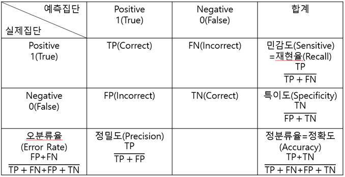

### 1절. 데이터 분할

#### 1. sample

-   sample(x, size, replace=FALSE, prob,…)

``` r
getwd()
```

    ## [1] "/Users/ljp/Desktop/study/R/ADP/Part 5. 정형 데이터마이닝"

``` r
credit.df <- read.csv('./german_credit.csv', header = TRUE)
head(credit.df)
```

    ##   Creditability Account.Balance Duration.of.Credit..month.
    ## 1             1               1                         18
    ## 2             1               1                          9
    ## 3             1               2                         12
    ## 4             1               1                         12
    ## 5             1               1                         12
    ## 6             1               1                         10
    ##   Payment.Status.of.Previous.Credit Purpose Credit.Amount Value.Savings.Stocks
    ## 1                                 4       2          1049                    1
    ## 2                                 4       0          2799                    1
    ## 3                                 2       9           841                    2
    ## 4                                 4       0          2122                    1
    ## 5                                 4       0          2171                    1
    ## 6                                 4       0          2241                    1
    ##   Length.of.current.employment Instalment.per.cent Sex...Marital.Status
    ## 1                            2                   4                    2
    ## 2                            3                   2                    3
    ## 3                            4                   2                    2
    ## 4                            3                   3                    3
    ## 5                            3                   4                    3
    ## 6                            2                   1                    3
    ##   Guarantors Duration.in.Current.address Most.valuable.available.asset
    ## 1          1                           4                             2
    ## 2          1                           2                             1
    ## 3          1                           4                             1
    ## 4          1                           2                             1
    ## 5          1                           4                             2
    ## 6          1                           3                             1
    ##   Age..years. Concurrent.Credits Type.of.apartment No.of.Credits.at.this.Bank
    ## 1          21                  3                 1                          1
    ## 2          36                  3                 1                          2
    ## 3          23                  3                 1                          1
    ## 4          39                  3                 1                          2
    ## 5          38                  1                 2                          2
    ## 6          48                  3                 1                          2
    ##   Occupation No.of.dependents Telephone Foreign.Worker
    ## 1          3                1         1              1
    ## 2          3                2         1              1
    ## 3          2                1         1              1
    ## 4          2                2         1              2
    ## 5          2                1         1              2
    ## 6          2                2         1              2

``` r
dim(credit.df)
```

    ## [1] 1000   21

``` r
set.seed(1)
idx <- sample(3, nrow(credit.df), replace=T, prob=c(0.5,0.3,0.2))
train <- credit.df[idx==1,]
validation <- credit.df[idx==2,]
test <- credit.df[idx==3,]

nrow(train)
```

    ## [1] 520

``` r
nrow(validation)
```

    ## [1] 282

``` r
nrow(test)
```

    ## [1] 198

#### 2. createDataPartition (caret 패키지)

: 목적변수를 고려한 데이터 분리를 지원

-   createDataPartition(y, times, p , list=TRUE,…)

    -   y : 종속변수

    -   times : 생성할 분할의 수

    -   p : 훈련 데이터의 비율

    -   list : 결과를 리스트로 반환할지 여부(TRUE : 리스트로 / FALSE :
        행렬로)

``` r
# install.packages('caret')
library(caret)
```

    ## Loading required package: ggplot2

    ## Loading required package: lattice

``` r
str(credit.df)
```

    ## 'data.frame':    1000 obs. of  21 variables:
    ##  $ Creditability                    : int  1 1 1 1 1 1 1 1 1 1 ...
    ##  $ Account.Balance                  : int  1 1 2 1 1 1 1 1 4 2 ...
    ##  $ Duration.of.Credit..month.       : int  18 9 12 12 12 10 8 6 18 24 ...
    ##  $ Payment.Status.of.Previous.Credit: int  4 4 2 4 4 4 4 4 4 2 ...
    ##  $ Purpose                          : int  2 0 9 0 0 0 0 0 3 3 ...
    ##  $ Credit.Amount                    : int  1049 2799 841 2122 2171 2241 3398 1361 1098 3758 ...
    ##  $ Value.Savings.Stocks             : int  1 1 2 1 1 1 1 1 1 3 ...
    ##  $ Length.of.current.employment     : int  2 3 4 3 3 2 4 2 1 1 ...
    ##  $ Instalment.per.cent              : int  4 2 2 3 4 1 1 2 4 1 ...
    ##  $ Sex...Marital.Status             : int  2 3 2 3 3 3 3 3 2 2 ...
    ##  $ Guarantors                       : int  1 1 1 1 1 1 1 1 1 1 ...
    ##  $ Duration.in.Current.address      : int  4 2 4 2 4 3 4 4 4 4 ...
    ##  $ Most.valuable.available.asset    : int  2 1 1 1 2 1 1 1 3 4 ...
    ##  $ Age..years.                      : int  21 36 23 39 38 48 39 40 65 23 ...
    ##  $ Concurrent.Credits               : int  3 3 3 3 1 3 3 3 3 3 ...
    ##  $ Type.of.apartment                : int  1 1 1 1 2 1 2 2 2 1 ...
    ##  $ No.of.Credits.at.this.Bank       : int  1 2 1 2 2 2 2 1 2 1 ...
    ##  $ Occupation                       : int  3 3 2 2 2 2 2 2 1 1 ...
    ##  $ No.of.dependents                 : int  1 2 1 2 1 2 1 2 1 1 ...
    ##  $ Telephone                        : int  1 1 1 1 1 1 1 1 1 1 ...
    ##  $ Foreign.Worker                   : int  1 1 1 2 2 2 2 2 1 1 ...

``` r
part <- createDataPartition(credit.df$Creditability,
                            times = 1,
                            p=0.7)
parts <- as.vector(part$Resample1)
train <- credit.df[parts,]
test <- credit.df[-parts,]

nrow(train)
```

    ## [1] 700

``` r
nrow(test)
```

    ## [1] 300

### 2절. 성과분석

#### 1. 오분류표(Confusion Matrix)

: 실제 범주와 예측된 분류 범주 사이의 관계를 나타내는 표



-   F1-score

$$
F_1 =2 \* \frac{Precision \* Recall}{Precision+Recall}= 2\* \frac{1}{\frac{1}{Recall}+\frac{1}{Precision}}
$$

-   Fβ-score

$$
F\_\beta = (1+\beta^2)\frac{Precision \* Recall}{(\beta^2\*Precision) + Recall}
$$

``` r
library(caret)

predicted <- factor(c(1,0,0,1,1,1,0,0,0,1,1,1))
actual <- factor(c(1,0,0,1,1,0,1,1,0,1,1,1))
table(predicted, actual)
```

    ##          actual
    ## predicted 0 1
    ##         0 3 2
    ##         1 1 6

``` r
sum(predicted==actual)/NROW(actual) # 정분류율
```

    ## [1] 0.75

``` r
confusionMatrix(predicted, actual)
```

    ## Confusion Matrix and Statistics
    ## 
    ##           Reference
    ## Prediction 0 1
    ##          0 3 2
    ##          1 1 6
    ##                                           
    ##                Accuracy : 0.75            
    ##                  95% CI : (0.4281, 0.9451)
    ##     No Information Rate : 0.6667          
    ##     P-Value [Acc > NIR] : 0.3931          
    ##                                           
    ##                   Kappa : 0.4706          
    ##                                           
    ##  Mcnemar's Test P-Value : 1.0000          
    ##                                           
    ##             Sensitivity : 0.7500          
    ##             Specificity : 0.7500          
    ##          Pos Pred Value : 0.6000          
    ##          Neg Pred Value : 0.8571          
    ##              Prevalence : 0.3333          
    ##          Detection Rate : 0.2500          
    ##    Detection Prevalence : 0.4167          
    ##       Balanced Accuracy : 0.7500          
    ##                                           
    ##        'Positive' Class : 0               
    ## 

#### 2. ROC(Receiver Operating Characteristic) 그래프

: 레이더 이미지 분석의 성과 측정, x축 : FP ratio(1-특이도) y축 : 민감도

AUC : ROC 그래의 밑부분 면적 =\> 넓을수록 좋은 모형

-   prediction(predictions, labels)

    -   prediction : 예측값

    -   labels : 실제값

-   performance(prediction.object, acc, fpr, tpr, …)

    -   prediction.obj : prediction 객체

    -   acc, fqr, tpr … : accuracy, fpr, tpr 등을 지정할 수 있음

``` r
#install.packages('ROCR')
library(ROCR)

set.seed(1)
probability <- runif(100)
labels <- ifelse(probability>0.5 & runif(100)<0.4, 1, 2)
pred <- prediction(probability, labels)
plot(performance(pred,'tpr','fpr')) # ROC curve
```


``` r
performance(pred,'auc')@y.values # AUC 값
```

    ## [[1]]
    ## [1] 0.181875
