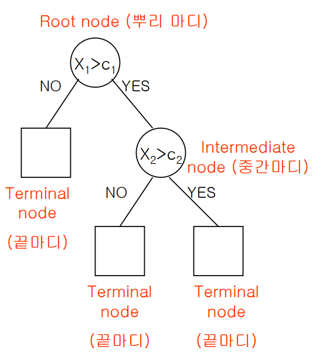

### 1절. 로지스틱 회귀분석

$$
logit(p) =log(odds) =log(\frac{P(y)}{1-P(y)}) = \beta_0 + \beta_1 x_1 +\cdots+\beta_k x_k \\
=\> P(y)=\frac{1}{1+exp\[-(\beta_0 + \beta_1 x_1 +\cdots+\beta_k x_k)\]}\\
$$

#### 1. R을 이용한 이항 로지스틱 회귀분석

-   glm(formula, data, family=‘binomial’)

    -   family : 분석에 따른 link function 선택 (binomial : 이항,
        gaussian : 가우시안, Gamma : 감마, poisson : 포아송)

-   predict(model, newdata, type,….)

    -   type : 예측 결과의 유형 (link : log-odds 값, ~~class : 범주형
        값~~, response : 0~1 확률값)

``` r
credit <- read.csv('german_credit.csv')
#head(credit)
credit$Creditability <- as.factor(credit$Creditability)
#str(credit)

set.seed(1)
idx <- sample(1:nrow(credit),nrow(credit)*0.7,replace=F)
train <- credit[idx,]
test <- credit[-idx,]

logistic <- glm(Creditability~.,
               data = train,
               family = 'binomial')
summary(logistic)
```

    ## 
    ## Call:
    ## glm(formula = Creditability ~ ., family = "binomial", data = train)
    ## 
    ## Coefficients:
    ##                                     Estimate Std. Error z value Pr(>|z|)    
    ## (Intercept)                       -3.998e+00  1.188e+00  -3.364 0.000767 ***
    ## Account.Balance                    5.809e-01  8.651e-02   6.714 1.89e-11 ***
    ## Duration.of.Credit..month.        -3.220e-02  1.070e-02  -3.008 0.002626 ** 
    ## Payment.Status.of.Previous.Credit  4.228e-01  1.026e-01   4.120 3.79e-05 ***
    ## Purpose                            6.230e-02  3.695e-02   1.686 0.091785 .  
    ## Credit.Amount                     -1.143e-04  4.932e-05  -2.317 0.020510 *  
    ## Value.Savings.Stocks               2.796e-01  7.200e-02   3.883 0.000103 ***
    ## Length.of.current.employment       7.883e-02  8.572e-02   0.920 0.357722    
    ## Instalment.per.cent               -3.966e-01  1.015e-01  -3.905 9.41e-05 ***
    ## Sex...Marital.Status               2.084e-01  1.414e-01   1.474 0.140545    
    ## Guarantors                         1.241e-01  2.115e-01   0.587 0.557360    
    ## Duration.in.Current.address        2.527e-02  9.685e-02   0.261 0.794152    
    ## Most.valuable.available.asset     -1.982e-01  1.138e-01  -1.742 0.081563 .  
    ## Age..years.                        1.952e-02  1.016e-02   1.921 0.054711 .  
    ## Concurrent.Credits                 1.532e-01  1.368e-01   1.120 0.262873    
    ## Type.of.apartment                  3.800e-01  2.101e-01   1.809 0.070501 .  
    ## No.of.Credits.at.this.Bank        -3.134e-01  1.874e-01  -1.672 0.094458 .  
    ## Occupation                         2.139e-01  1.657e-01   1.291 0.196815    
    ## No.of.dependents                  -2.902e-02  2.893e-01  -0.100 0.920102    
    ## Telephone                          1.914e-01  2.257e-01   0.848 0.396503    
    ## Foreign.Worker                     1.151e+00  6.404e-01   1.797 0.072340 .  
    ## ---
    ## Signif. codes:  0 '***' 0.001 '**' 0.01 '*' 0.05 '.' 0.1 ' ' 1
    ## 
    ## (Dispersion parameter for binomial family taken to be 1)
    ## 
    ##     Null deviance: 865.13  on 699  degrees of freedom
    ## Residual deviance: 652.97  on 679  degrees of freedom
    ## AIC: 694.97
    ## 
    ## Number of Fisher Scoring iterations: 5

=\> 회귀계수의 p-value가 0.05보다 높게 나타나는 변수가 많으므로 단계적
선택법 이용

-   이탈도(Deviance) : 추정된 모형의 적합도를 평가하는 지표

    =\> 추정된 모형과 포화모형(완전모형,full model)의 차이

    -   Null deviance : 절편만 추가된 모형의 이탈도

    -   Residual deviance : 예측변수가 추가된 모형의 이탈도

        =\> 값이 작을수록 모형의 적합도가 더 좋다

``` r
# anova로 이탈도에 대해 자세한 분석 가능
anova(logistic, test = 'Chisq')
```

    ## Analysis of Deviance Table
    ## 
    ## Model: binomial, link: logit
    ## 
    ## Response: Creditability
    ## 
    ## Terms added sequentially (first to last)
    ## 
    ## 
    ##                                   Df Deviance Resid. Df Resid. Dev  Pr(>Chi)
    ## NULL                                                699     865.13          
    ## Account.Balance                    1   93.955       698     771.18 < 2.2e-16
    ## Duration.of.Credit..month.         1   40.590       697     730.59 1.877e-10
    ## Payment.Status.of.Previous.Credit  1   20.190       696     710.40 7.012e-06
    ## Purpose                            1    1.236       695     709.16 0.2662565
    ## Credit.Amount                      1    0.070       694     709.09 0.7919301
    ## Value.Savings.Stocks               1   16.709       693     692.38 4.357e-05
    ## Length.of.current.employment       1    1.915       692     690.47 0.1664604
    ## Instalment.per.cent                1   11.936       691     678.53 0.0005507
    ## Sex...Marital.Status               1    3.092       690     675.44 0.0786905
    ## Guarantors                         1    0.687       689     674.75 0.4071857
    ## Duration.in.Current.address        1    0.022       688     674.73 0.8808371
    ## Most.valuable.available.asset      1    0.718       687     674.01 0.3969306
    ## Age..years.                        1    6.565       686     667.45 0.0104031
    ## Concurrent.Credits                 1    1.338       685     666.11 0.2473052
    ## Type.of.apartment                  1    3.281       684     662.83 0.0700820
    ## No.of.Credits.at.this.Bank         1    2.944       683     659.89 0.0862093
    ## Occupation                         1    2.564       682     657.32 0.1092894
    ## No.of.dependents                   1    0.003       681     657.32 0.9560865
    ## Telephone                          1    0.603       680     656.72 0.4373880
    ## Foreign.Worker                     1    3.747       679     652.97 0.0528994
    ##                                      
    ## NULL                                 
    ## Account.Balance                   ***
    ## Duration.of.Credit..month.        ***
    ## Payment.Status.of.Previous.Credit ***
    ## Purpose                              
    ## Credit.Amount                        
    ## Value.Savings.Stocks              ***
    ## Length.of.current.employment         
    ## Instalment.per.cent               ***
    ## Sex...Marital.Status              .  
    ## Guarantors                           
    ## Duration.in.Current.address          
    ## Most.valuable.available.asset        
    ## Age..years.                       *  
    ## Concurrent.Credits                   
    ## Type.of.apartment                 .  
    ## No.of.Credits.at.this.Bank        .  
    ## Occupation                           
    ## No.of.dependents                     
    ## Telephone                            
    ## Foreign.Worker                    .  
    ## ---
    ## Signif. codes:  0 '***' 0.001 '**' 0.01 '*' 0.05 '.' 0.1 ' ' 1

-   step함수를 이용한 로지스틱

``` r
# step 함수를 이용한 로지스틱 
step.logistic <- step(glm(Creditability~1, data = train, family = 'binomial'),
                      scope = list(lower=~1, upper=~Account.Balance+Duration.of.Credit..month.+Payment.Status.of.Previous.Credit+Purpose+Credit.Amount+Value.Savings.Stocks+Length.of.current.employment+Instalment.per.cent+Sex...Marital.Status+Guarantors+Duration.in.Current.address+Most.valuable.available.asset+Age..years.+Concurrent.Credits+Type.of.apartment+No.of.Credits.at.this.Bank+Occupation+No.of.dependents+Telephone+Foreign.Worker),
                      direction = 'both')
```

    ## Start:  AIC=867.13
    ## Creditability ~ 1
    ## 
    ##                                     Df Deviance    AIC
    ## + Account.Balance                    1   771.18 775.18
    ## + Payment.Status.of.Previous.Credit  1   821.32 825.32
    ## + Duration.of.Credit..month.         1   823.19 827.19
    ## + Value.Savings.Stocks               1   832.27 836.27
    ## + Credit.Amount                      1   847.56 851.56
    ## + Age..years.                        1   851.40 855.40
    ## + Most.valuable.available.asset      1   852.22 856.22
    ## + Length.of.current.employment       1   857.35 861.35
    ## + Instalment.per.cent                1   859.24 863.24
    ## + Foreign.Worker                     1   859.91 863.91
    ## + Sex...Marital.Status               1   860.89 864.89
    ## + Concurrent.Credits                 1   861.51 865.51
    ## <none>                                   865.13 867.13
    ## + Type.of.apartment                  1   863.41 867.41
    ## + Telephone                          1   863.89 867.89
    ## + No.of.Credits.at.this.Bank         1   864.27 868.27
    ## + No.of.dependents                   1   864.45 868.45
    ## + Occupation                         1   864.62 868.62
    ## + Guarantors                         1   865.10 869.10
    ## + Purpose                            1   865.13 869.13
    ## + Duration.in.Current.address        1   865.13 869.13
    ## 
    ## Step:  AIC=775.18
    ## Creditability ~ Account.Balance
    ## 
    ##                                     Df Deviance    AIC
    ## + Duration.of.Credit..month.         1   730.59 736.59
    ## + Payment.Status.of.Previous.Credit  1   745.17 751.17
    ## + Credit.Amount                      1   752.61 758.61
    ## + Most.valuable.available.asset      1   758.17 764.17
    ## + Value.Savings.Stocks               1   759.12 765.12
    ## + Age..years.                        1   762.86 768.86
    ## + Foreign.Worker                     1   763.08 769.08
    ## + Instalment.per.cent                1   763.87 769.87
    ## + Length.of.current.employment       1   767.46 773.46
    ## + Sex...Marital.Status               1   768.09 774.09
    ## + Concurrent.Credits                 1   768.75 774.75
    ## <none>                                   771.18 775.18
    ## + Occupation                         1   769.78 775.78
    ## + No.of.dependents                   1   770.31 776.31
    ## + Type.of.apartment                  1   770.32 776.32
    ## + Guarantors                         1   770.34 776.34
    ## + Duration.in.Current.address        1   770.61 776.61
    ## + No.of.Credits.at.this.Bank         1   770.86 776.86
    ## + Telephone                          1   770.97 776.97
    ## + Purpose                            1   770.97 776.97
    ## - Account.Balance                    1   865.13 867.13
    ## 
    ## Step:  AIC=736.59
    ## Creditability ~ Account.Balance + Duration.of.Credit..month.
    ## 
    ##                                     Df Deviance    AIC
    ## + Payment.Status.of.Previous.Credit  1   710.40 718.40
    ## + Value.Savings.Stocks               1   715.89 723.89
    ## + Age..years.                        1   721.49 729.49
    ## + Instalment.per.cent                1   724.12 732.12
    ## + Length.of.current.employment       1   724.78 732.78
    ## + Type.of.apartment                  1   725.69 733.69
    ## + Foreign.Worker                     1   725.84 733.84
    ## + Sex...Marital.Status               1   727.24 735.24
    ## + Most.valuable.available.asset      1   728.54 736.54
    ## <none>                                   730.59 736.59
    ## + Telephone                          1   728.86 736.86
    ## + Concurrent.Credits                 1   729.13 737.13
    ## + Duration.in.Current.address        1   729.44 737.44
    ## + No.of.dependents                   1   729.78 737.78
    ## + Guarantors                         1   730.13 738.13
    ## + Purpose                            1   730.25 738.25
    ## + No.of.Credits.at.this.Bank         1   730.42 738.42
    ## + Credit.Amount                      1   730.42 738.42
    ## + Occupation                         1   730.51 738.51
    ## - Duration.of.Credit..month.         1   771.18 775.18
    ## - Account.Balance                    1   823.19 827.19
    ## 
    ## Step:  AIC=718.4
    ## Creditability ~ Account.Balance + Duration.of.Credit..month. + 
    ##     Payment.Status.of.Previous.Credit
    ## 
    ##                                     Df Deviance    AIC
    ## + Value.Savings.Stocks               1   694.14 704.14
    ## + Instalment.per.cent                1   703.13 713.13
    ## + Age..years.                        1   704.44 714.44
    ## + Foreign.Worker                     1   706.60 716.60
    ## + Type.of.apartment                  1   706.68 716.68
    ## + Length.of.current.employment       1   706.79 716.79
    ## + Sex...Marital.Status               1   707.40 717.40
    ## + No.of.Credits.at.this.Bank         1   708.22 718.22
    ## <none>                                   710.40 718.40
    ## + Most.valuable.available.asset      1   708.81 718.81
    ## + Telephone                          1   708.93 718.93
    ## + Purpose                            1   709.16 719.16
    ## + Concurrent.Credits                 1   709.76 719.76
    ## + No.of.dependents                   1   709.99 719.99
    ## + Duration.in.Current.address        1   710.01 720.01
    ## + Guarantors                         1   710.04 720.04
    ## + Occupation                         1   710.28 720.28
    ## + Credit.Amount                      1   710.32 720.32
    ## - Payment.Status.of.Previous.Credit  1   730.59 736.59
    ## - Duration.of.Credit..month.         1   745.17 751.17
    ## - Account.Balance                    1   785.00 791.00
    ## 
    ## Step:  AIC=704.14
    ## Creditability ~ Account.Balance + Duration.of.Credit..month. + 
    ##     Payment.Status.of.Previous.Credit + Value.Savings.Stocks
    ## 
    ##                                     Df Deviance    AIC
    ## + Instalment.per.cent                1   686.26 698.26
    ## + Age..years.                        1   688.87 700.87
    ## + Type.of.apartment                  1   690.08 702.08
    ## + Foreign.Worker                     1   690.30 702.30
    ## + Sex...Marital.Status               1   691.61 703.61
    ## + Length.of.current.employment       1   692.04 704.04
    ## <none>                                   694.14 704.14
    ## + No.of.Credits.at.this.Bank         1   692.34 704.34
    ## + Most.valuable.available.asset      1   692.50 704.50
    ## + Purpose                            1   692.52 704.52
    ## + Telephone                          1   692.59 704.59
    ## + Guarantors                         1   693.24 705.24
    ## + Concurrent.Credits                 1   693.61 705.61
    ## + No.of.dependents                   1   693.85 705.85
    ## + Occupation                         1   693.88 705.88
    ## + Credit.Amount                      1   693.99 705.99
    ## + Duration.in.Current.address        1   694.04 706.04
    ## - Value.Savings.Stocks               1   710.40 718.40
    ## - Payment.Status.of.Previous.Credit  1   715.89 723.89
    ## - Duration.of.Credit..month.         1   731.74 739.74
    ## - Account.Balance                    1   747.58 755.58
    ## 
    ## Step:  AIC=698.26
    ## Creditability ~ Account.Balance + Duration.of.Credit..month. + 
    ##     Payment.Status.of.Previous.Credit + Value.Savings.Stocks + 
    ##     Instalment.per.cent
    ## 
    ##                                     Df Deviance    AIC
    ## + Age..years.                        1   680.19 694.19
    ## + Type.of.apartment                  1   681.49 695.49
    ## + Sex...Marital.Status               1   682.69 696.69
    ## + Foreign.Worker                     1   683.09 697.09
    ## + Length.of.current.employment       1   683.16 697.16
    ## + Credit.Amount                      1   683.27 697.27
    ## <none>                                   686.26 698.26
    ## + No.of.Credits.at.this.Bank         1   684.41 698.41
    ## + Purpose                            1   684.57 698.57
    ## + Most.valuable.available.asset      1   684.73 698.73
    ## + Telephone                          1   685.12 699.12
    ## + Guarantors                         1   685.14 699.14
    ## + Concurrent.Credits                 1   685.45 699.45
    ## + Occupation                         1   685.78 699.78
    ## + Duration.in.Current.address        1   686.02 700.02
    ## + No.of.dependents                   1   686.07 700.07
    ## - Instalment.per.cent                1   694.14 704.14
    ## - Value.Savings.Stocks               1   703.13 713.13
    ## - Payment.Status.of.Previous.Credit  1   708.75 718.75
    ## - Duration.of.Credit..month.         1   722.93 732.93
    ## - Account.Balance                    1   740.75 750.75
    ## 
    ## Step:  AIC=694.19
    ## Creditability ~ Account.Balance + Duration.of.Credit..month. + 
    ##     Payment.Status.of.Previous.Credit + Value.Savings.Stocks + 
    ##     Instalment.per.cent + Age..years.
    ## 
    ##                                     Df Deviance    AIC
    ## + Credit.Amount                      1   675.76 691.76
    ## + Sex...Marital.Status               1   676.39 692.39
    ## + Foreign.Worker                     1   677.02 693.02
    ## + No.of.Credits.at.this.Bank         1   677.43 693.43
    ## + Most.valuable.available.asset      1   677.50 693.50
    ## + Type.of.apartment                  1   678.15 694.15
    ## <none>                                   680.19 694.19
    ## + Purpose                            1   678.61 694.61
    ## + Length.of.current.employment       1   678.69 694.69
    ## + Concurrent.Credits                 1   679.08 695.08
    ## + Guarantors                         1   679.10 695.10
    ## + Occupation                         1   679.73 695.73
    ## + Telephone                          1   679.77 695.77
    ## + No.of.dependents                   1   680.18 696.18
    ## + Duration.in.Current.address        1   680.19 696.19
    ## - Age..years.                        1   686.26 698.26
    ## - Instalment.per.cent                1   688.87 700.87
    ## - Value.Savings.Stocks               1   696.25 708.25
    ## - Payment.Status.of.Previous.Credit  1   699.37 711.37
    ## - Duration.of.Credit..month.         1   717.78 729.78
    ## - Account.Balance                    1   733.58 745.58
    ## 
    ## Step:  AIC=691.76
    ## Creditability ~ Account.Balance + Duration.of.Credit..month. + 
    ##     Payment.Status.of.Previous.Credit + Value.Savings.Stocks + 
    ##     Instalment.per.cent + Age..years. + Credit.Amount
    ## 
    ##                                     Df Deviance    AIC
    ## + Sex...Marital.Status               1   672.03 690.03
    ## + Foreign.Worker                     1   672.10 690.10
    ## + No.of.Credits.at.this.Bank         1   673.32 691.32
    ## + Type.of.apartment                  1   673.34 691.34
    ## <none>                                   675.76 691.76
    ## + Most.valuable.available.asset      1   673.91 691.91
    ## + Purpose                            1   674.19 692.19
    ## + Occupation                         1   674.23 692.23
    ## + Length.of.current.employment       1   674.36 692.36
    ## + Telephone                          1   674.40 692.40
    ## + Guarantors                         1   674.74 692.74
    ## + Concurrent.Credits                 1   674.90 692.90
    ## + Duration.in.Current.address        1   675.73 693.73
    ## + No.of.dependents                   1   675.76 693.76
    ## - Credit.Amount                      1   680.19 694.19
    ## - Age..years.                        1   683.27 697.27
    ## - Duration.of.Credit..month.         1   686.38 700.38
    ## - Instalment.per.cent                1   688.45 702.45
    ## - Value.Savings.Stocks               1   692.49 706.49
    ## - Payment.Status.of.Previous.Credit  1   694.56 708.56
    ## - Account.Balance                    1   730.29 744.29
    ## 
    ## Step:  AIC=690.03
    ## Creditability ~ Account.Balance + Duration.of.Credit..month. + 
    ##     Payment.Status.of.Previous.Credit + Value.Savings.Stocks + 
    ##     Instalment.per.cent + Age..years. + Credit.Amount + Sex...Marital.Status
    ## 
    ##                                     Df Deviance    AIC
    ## + Foreign.Worker                     1   668.72 688.72
    ## + No.of.Credits.at.this.Bank         1   669.20 689.20
    ## <none>                                   672.03 690.03
    ## + Type.of.apartment                  1   670.35 690.35
    ## + Occupation                         1   670.38 690.38
    ## + Most.valuable.available.asset      1   670.41 690.41
    ## + Purpose                            1   670.43 690.43
    ## + Telephone                          1   670.81 690.81
    ## + Concurrent.Credits                 1   670.89 690.89
    ## + Length.of.current.employment       1   670.97 690.97
    ## + Guarantors                         1   671.35 691.35
    ## - Sex...Marital.Status               1   675.76 691.76
    ## + No.of.dependents                   1   671.97 691.97
    ## + Duration.in.Current.address        1   672.02 692.02
    ## - Credit.Amount                      1   676.39 692.39
    ## - Age..years.                        1   679.71 695.71
    ## - Duration.of.Credit..month.         1   682.58 698.58
    ## - Instalment.per.cent                1   685.87 701.87
    ## - Value.Savings.Stocks               1   688.14 704.14
    ## - Payment.Status.of.Previous.Credit  1   690.76 706.76
    ## - Account.Balance                    1   725.72 741.72
    ## 
    ## Step:  AIC=688.72
    ## Creditability ~ Account.Balance + Duration.of.Credit..month. + 
    ##     Payment.Status.of.Previous.Credit + Value.Savings.Stocks + 
    ##     Instalment.per.cent + Age..years. + Credit.Amount + Sex...Marital.Status + 
    ##     Foreign.Worker
    ## 
    ##                                     Df Deviance    AIC
    ## + No.of.Credits.at.this.Bank         1   666.16 688.16
    ## + Type.of.apartment                  1   666.61 688.61
    ## <none>                                   668.72 688.72
    ## + Purpose                            1   666.74 688.74
    ## + Occupation                         1   666.92 688.92
    ## + Telephone                          1   667.28 689.28
    ## + Concurrent.Credits                 1   667.36 689.36
    ## + Most.valuable.available.asset      1   667.51 689.51
    ## + Length.of.current.employment       1   667.62 689.62
    ## - Foreign.Worker                     1   672.03 690.03
    ## - Sex...Marital.Status               1   672.10 690.10
    ## + Guarantors                         1   668.42 690.42
    ## + No.of.dependents                   1   668.66 690.66
    ## + Duration.in.Current.address        1   668.72 690.72
    ## - Credit.Amount                      1   673.57 691.57
    ## - Age..years.                        1   676.50 694.50
    ## - Duration.of.Credit..month.         1   677.94 695.94
    ## - Instalment.per.cent                1   682.15 700.15
    ## - Value.Savings.Stocks               1   684.89 702.89
    ## - Payment.Status.of.Previous.Credit  1   686.61 704.61
    ## - Account.Balance                    1   723.76 741.76
    ## 
    ## Step:  AIC=688.16
    ## Creditability ~ Account.Balance + Duration.of.Credit..month. + 
    ##     Payment.Status.of.Previous.Credit + Value.Savings.Stocks + 
    ##     Instalment.per.cent + Age..years. + Credit.Amount + Sex...Marital.Status + 
    ##     Foreign.Worker + No.of.Credits.at.this.Bank
    ## 
    ##                                     Df Deviance    AIC
    ## + Purpose                            1   663.22 687.22
    ## <none>                                   666.16 688.16
    ## + Type.of.apartment                  1   664.30 688.30
    ## + Occupation                         1   664.47 688.47
    ## + Telephone                          1   664.49 688.49
    ## - No.of.Credits.at.this.Bank         1   668.72 688.72
    ## + Length.of.current.employment       1   664.91 688.91
    ## + Most.valuable.available.asset      1   664.96 688.96
    ## + Concurrent.Credits                 1   665.19 689.19
    ## - Foreign.Worker                     1   669.20 689.20
    ## - Sex...Marital.Status               1   669.90 689.90
    ## + Guarantors                         1   665.90 689.90
    ## + No.of.dependents                   1   666.14 690.14
    ## + Duration.in.Current.address        1   666.15 690.15
    ## - Credit.Amount                      1   670.62 690.62
    ## - Age..years.                        1   674.81 694.81
    ## - Duration.of.Credit..month.         1   675.54 695.54
    ## - Instalment.per.cent                1   679.64 699.64
    ## - Value.Savings.Stocks               1   681.73 701.73
    ## - Payment.Status.of.Previous.Credit  1   686.61 706.61
    ## - Account.Balance                    1   720.85 740.85
    ## 
    ## Step:  AIC=687.22
    ## Creditability ~ Account.Balance + Duration.of.Credit..month. + 
    ##     Payment.Status.of.Previous.Credit + Value.Savings.Stocks + 
    ##     Instalment.per.cent + Age..years. + Credit.Amount + Sex...Marital.Status + 
    ##     Foreign.Worker + No.of.Credits.at.this.Bank + Purpose
    ## 
    ##                                     Df Deviance    AIC
    ## + Occupation                         1   661.16 687.16
    ## <none>                                   663.22 687.22
    ## + Type.of.apartment                  1   661.44 687.44
    ## + Telephone                          1   661.79 687.79
    ## + Concurrent.Credits                 1   661.96 687.96
    ## + Length.of.current.employment       1   662.10 688.10
    ## - Purpose                            1   666.16 688.16
    ## + Most.valuable.available.asset      1   662.17 688.17
    ## - Foreign.Worker                     1   666.68 688.68
    ## - No.of.Credits.at.this.Bank         1   666.74 688.74
    ## + Guarantors                         1   662.98 688.98
    ## - Sex...Marital.Status               1   667.04 689.04
    ## + Duration.in.Current.address        1   663.21 689.21
    ## + No.of.dependents                   1   663.22 689.22
    ## - Credit.Amount                      1   667.70 689.70
    ## - Age..years.                        1   671.92 693.92
    ## - Duration.of.Credit..month.         1   673.75 695.75
    ## - Instalment.per.cent                1   676.84 698.84
    ## - Value.Savings.Stocks               1   679.09 701.09
    ## - Payment.Status.of.Previous.Credit  1   685.83 707.83
    ## - Account.Balance                    1   716.02 738.02
    ## 
    ## Step:  AIC=687.16
    ## Creditability ~ Account.Balance + Duration.of.Credit..month. + 
    ##     Payment.Status.of.Previous.Credit + Value.Savings.Stocks + 
    ##     Instalment.per.cent + Age..years. + Credit.Amount + Sex...Marital.Status + 
    ##     Foreign.Worker + No.of.Credits.at.this.Bank + Purpose + Occupation
    ## 
    ##                                     Df Deviance    AIC
    ## <none>                                   661.16 687.16
    ## + Most.valuable.available.asset      1   659.17 687.17
    ## - Occupation                         1   663.22 687.22
    ## + Type.of.apartment                  1   659.67 687.67
    ## + Concurrent.Credits                 1   659.89 687.89
    ## + Length.of.current.employment       1   660.34 688.34
    ## - Purpose                            1   664.47 688.47
    ## + Telephone                          1   660.51 688.51
    ## - No.of.Credits.at.this.Bank         1   664.63 688.63
    ## + Guarantors                         1   660.76 688.76
    ## - Foreign.Worker                     1   664.83 688.83
    ## - Sex...Marital.Status               1   665.10 689.10
    ## + Duration.in.Current.address        1   661.14 689.14
    ## + No.of.dependents                   1   661.16 689.16
    ## - Credit.Amount                      1   666.95 690.95
    ## - Age..years.                        1   670.07 694.07
    ## - Duration.of.Credit..month.         1   671.85 695.85
    ## - Instalment.per.cent                1   676.21 700.21
    ## - Value.Savings.Stocks               1   677.72 701.72
    ## - Payment.Status.of.Previous.Credit  1   683.84 707.84
    ## - Account.Balance                    1   712.46 736.46

``` r
summary(step.logistic)
```

    ## 
    ## Call:
    ## glm(formula = Creditability ~ Account.Balance + Duration.of.Credit..month. + 
    ##     Payment.Status.of.Previous.Credit + Value.Savings.Stocks + 
    ##     Instalment.per.cent + Age..years. + Credit.Amount + Sex...Marital.Status + 
    ##     Foreign.Worker + No.of.Credits.at.this.Bank + Purpose + Occupation, 
    ##     family = "binomial", data = train)
    ## 
    ## Coefficients:
    ##                                     Estimate Std. Error z value Pr(>|z|)    
    ## (Intercept)                       -3.074e+00  9.855e-01  -3.119 0.001813 ** 
    ## Account.Balance                    5.819e-01  8.524e-02   6.826 8.73e-12 ***
    ## Duration.of.Credit..month.        -3.356e-02  1.041e-02  -3.224 0.001266 ** 
    ## Payment.Status.of.Previous.Credit  4.621e-01  1.008e-01   4.583 4.58e-06 ***
    ## Value.Savings.Stocks               2.738e-01  7.014e-02   3.904 9.47e-05 ***
    ## Instalment.per.cent               -3.802e-01  1.004e-01  -3.787 0.000153 ***
    ## Age..years.                        2.627e-02  9.008e-03   2.917 0.003536 ** 
    ## Credit.Amount                     -1.155e-04  4.801e-05  -2.406 0.016138 *  
    ## Sex...Marital.Status               2.679e-01  1.355e-01   1.977 0.048045 *  
    ## Foreign.Worker                     1.105e+00  6.245e-01   1.770 0.076676 .  
    ## No.of.Credits.at.this.Bank        -3.363e-01  1.810e-01  -1.858 0.063171 .  
    ## Purpose                            6.554e-02  3.650e-02   1.796 0.072553 .  
    ## Occupation                         2.179e-01  1.517e-01   1.436 0.150887    
    ## ---
    ## Signif. codes:  0 '***' 0.001 '**' 0.01 '*' 0.05 '.' 0.1 ' ' 1
    ## 
    ## (Dispersion parameter for binomial family taken to be 1)
    ## 
    ##     Null deviance: 865.13  on 699  degrees of freedom
    ## Residual deviance: 661.16  on 687  degrees of freedom
    ## AIC: 687.16
    ## 
    ## Number of Fisher Scoring iterations: 5

``` r
pred <- predict(step.logistic, test[,-1],type = 'response')
pred1 <- as.data.frame(pred)
pred1$grade <- ifelse(pred1$pred<0.5,0,1)

library(caret)
```

    ## Loading required package: ggplot2

    ## Loading required package: lattice

``` r
confusionMatrix(data = as.factor(pred1$grade), reference = test[,1], positive = '1')
```

    ## Confusion Matrix and Statistics
    ## 
    ##           Reference
    ## Prediction   0   1
    ##          0  37  33
    ##          1  47 183
    ##                                           
    ##                Accuracy : 0.7333          
    ##                  95% CI : (0.6795, 0.7825)
    ##     No Information Rate : 0.72            
    ##     P-Value [Acc > NIR] : 0.3291          
    ##                                           
    ##                   Kappa : 0.3031          
    ##                                           
    ##  Mcnemar's Test P-Value : 0.1461          
    ##                                           
    ##             Sensitivity : 0.8472          
    ##             Specificity : 0.4405          
    ##          Pos Pred Value : 0.7957          
    ##          Neg Pred Value : 0.5286          
    ##              Prevalence : 0.7200          
    ##          Detection Rate : 0.6100          
    ##    Detection Prevalence : 0.7667          
    ##       Balanced Accuracy : 0.6438          
    ##                                           
    ##        'Positive' Class : 1               
    ## 

``` r
# ROC
library(ROCR)
pred.logistic.roc <- prediction(as.numeric(pred1$grade),as.numeric(test[,1]))
plot(performance(pred.logistic.roc, 'tpr','fpr'))
```


``` r
performance(pred.logistic.roc,'auc')@y.values
```

    ## [[1]]
    ## [1] 0.6438492

#### 2. R을 이용한 다항 로지스틱 회귀분석(nnet 패키지)

-   multinom(formula, data)

``` r
data(iris)

set.seed(1)
idx <- sample(1:nrow(iris),nrow(iris)*0.7,replace=F)
train.iris <- iris[idx,]
test.iris <- iris[-idx,]

library(nnet)
mul.iris <- multinom(Species~., train.iris)
```

    ## # weights:  18 (10 variable)
    ## initial  value 115.354290 
    ## iter  10 value 11.843953
    ## iter  20 value 4.770225
    ## iter  30 value 4.634061
    ## iter  40 value 4.621675
    ## iter  50 value 4.610482
    ## iter  60 value 4.599042
    ## iter  70 value 4.588547
    ## iter  80 value 4.587429
    ## iter  90 value 4.586110
    ## iter 100 value 4.585787
    ## final  value 4.585787 
    ## stopped after 100 iterations

``` r
pred.iris <- predict(mul.iris, test.iris[,-5])

confusionMatrix(pred.iris,test.iris[,5])
```

    ## Confusion Matrix and Statistics
    ## 
    ##             Reference
    ## Prediction   setosa versicolor virginica
    ##   setosa         15          0         0
    ##   versicolor      0         17         2
    ##   virginica       0          0        11
    ## 
    ## Overall Statistics
    ##                                           
    ##                Accuracy : 0.9556          
    ##                  95% CI : (0.8485, 0.9946)
    ##     No Information Rate : 0.3778          
    ##     P-Value [Acc > NIR] : 2.61e-16        
    ##                                           
    ##                   Kappa : 0.9325          
    ##                                           
    ##  Mcnemar's Test P-Value : NA              
    ## 
    ## Statistics by Class:
    ## 
    ##                      Class: setosa Class: versicolor Class: virginica
    ## Sensitivity                 1.0000            1.0000           0.8462
    ## Specificity                 1.0000            0.9286           1.0000
    ## Pos Pred Value              1.0000            0.8947           1.0000
    ## Neg Pred Value              1.0000            1.0000           0.9412
    ## Prevalence                  0.3333            0.3778           0.2889
    ## Detection Rate              0.3333            0.3778           0.2444
    ## Detection Prevalence        0.3333            0.4222           0.2444
    ## Balanced Accuracy           1.0000            0.9643           0.9231

### 2절. 의사결정나무



#### 1. 의사결정나무의 분석 과정

의사결정나무의 형성과정 - 성장, 가지치기, 타당성 평가, 해석 및 예측

-   성장

    적절한 최적의 분리 규칙(splitting rule)을 통해 성장,
    정지규칙(stopping rule)을 통해 중단

    이산형 종속변수 - 카이제곱 통계량 p-value, 지니 지수, 엔트로피
    지수  
    연속형 종속변수 - 분산분석에서 F 통계량, 분산의 감소량

-   가지치기

    마디에 속하는 자료가 일정 수(일반적으로 5) 이하 일 때 분할 정지하고
    비용-복잡도 가지치기

    ※ 모형의 복잡도 = 나무의 크기

-   타당성 평가 단계

    이익도표, 위험도표, 시험자료를 이용하여 의사결정 나무를 평가

-   해석 및 예측 단계

#### 2. 의사결정나무 알고리즘

-   CART(Classification and Regression Tree) : 범주형 -\> 지니지수,
    연속형 -\> 분산

-   C4.5 와 C5.0 : 다지분리 가능, 범주형 -\> 엔트로피지수

-   CHAID(Chi-squared Automatic Interaction Detection) : 범주형 변수 -\>
    카이제곱 통계량

#### 3. R을 이용한 의사결정나무 분석 (rpart 패키지)

-   rpart(formula, data, method, control=rpart.control(),…)

    CART 방법

    -   method : 의사결정나무 tree 종류
        선정(‘anova’,‘poisson’,‘class’,‘exp’)

    -   control : 의사결정나무를 만들 때 사용할 option 설정

``` r
library(rpart)
library(rpart.plot)
dt.model <- rpart(Creditability~.,
                  method = 'class',
                  data = train,
                  control = rpart.control(maxdepth = 5,
                                          minsplit = 15))
prp(dt.model, type = 4, extra = 2)
```


``` r
dt.model$cptable
```

    ##           CP nsplit rel error    xerror       xstd
    ## 1 0.08564815      0 1.0000000 1.0000000 0.05657789
    ## 2 0.05555556      2 0.8287037 0.8935185 0.05473686
    ## 3 0.02777778      3 0.7731481 0.8796296 0.05447022
    ## 4 0.01157407      5 0.7175926 0.8379630 0.05363153
    ## 5 0.01000000      9 0.6712963 0.8333333 0.05353467

-   cptable

    -   nsplit : 분할 횟수

    -   xerror, std : 해당 CP(복잡도)에서 cross validation했을 때
        오류율, 편차

        =\> xerror가 가장 낮은 split 개수를 선택  
        (분할을 5번 진행)

``` r
# 최적 나무 선정
opt <- which.min(dt.model$cptable[,'xerror'])
cp <- dt.model$cptable[opt,"CP"]
prune.c <- prune(dt.model,cp=cp)
plotcp(dt.model)
```


-   plotcp

    =\> xerror가 가장 낮을 때, 결과에 따라 교차타당성오차를 최소로 하는
    트리를 형성  
    (나무의 크기가 10일 때 최적의 나무)

``` r
# 오분류표
library(caret)
pred.dt <- predict(dt.model, test[,-1],type = 'class')
confusionMatrix(data = pred.dt, reference = test[,1],positive = '1')
```

    ## Confusion Matrix and Statistics
    ## 
    ##           Reference
    ## Prediction   0   1
    ##          0  43  37
    ##          1  41 179
    ##                                           
    ##                Accuracy : 0.74            
    ##                  95% CI : (0.6865, 0.7887)
    ##     No Information Rate : 0.72            
    ##     P-Value [Acc > NIR] : 0.2412          
    ##                                           
    ##                   Kappa : 0.3456          
    ##                                           
    ##  Mcnemar's Test P-Value : 0.7341          
    ##                                           
    ##             Sensitivity : 0.8287          
    ##             Specificity : 0.5119          
    ##          Pos Pred Value : 0.8136          
    ##          Neg Pred Value : 0.5375          
    ##              Prevalence : 0.7200          
    ##          Detection Rate : 0.5967          
    ##    Detection Prevalence : 0.7333          
    ##       Balanced Accuracy : 0.6703          
    ##                                           
    ##        'Positive' Class : 1               
    ## 

``` r
# ROC 그래프
library(ROCR)
pred.dt.roc <- prediction(as.numeric(pred.dt),as.numeric(test[,1]))
plot(performance(pred.dt.roc,'tpr','fpr'))
```


``` r
performance(pred.dt.roc,'auc')@y.values # AUC
```

    ## [[1]]
    ## [1] 0.6703042

#### 예제 - iris

``` r
library(rpart)
library(rpart.plot)

dt.model2 <- rpart(Species~., data = train.iris)
prp(dt.model2, type = 4, extra = 2)
```


``` r
pred.dt2 <- predict(dt.model2, test.iris[,-5],type = 'class')
confusionMatrix(data = pred.dt2, reference = test.iris[,5])
```

    ## Confusion Matrix and Statistics
    ## 
    ##             Reference
    ## Prediction   setosa versicolor virginica
    ##   setosa         15          0         0
    ##   versicolor      0         17         4
    ##   virginica       0          0         9
    ## 
    ## Overall Statistics
    ##                                           
    ##                Accuracy : 0.9111          
    ##                  95% CI : (0.7878, 0.9752)
    ##     No Information Rate : 0.3778          
    ##     P-Value [Acc > NIR] : 1.099e-13       
    ##                                           
    ##                   Kappa : 0.8643          
    ##                                           
    ##  Mcnemar's Test P-Value : NA              
    ## 
    ## Statistics by Class:
    ## 
    ##                      Class: setosa Class: versicolor Class: virginica
    ## Sensitivity                 1.0000            1.0000           0.6923
    ## Specificity                 1.0000            0.8571           1.0000
    ## Pos Pred Value              1.0000            0.8095           1.0000
    ## Neg Pred Value              1.0000            1.0000           0.8889
    ## Prevalence                  0.3333            0.3778           0.2889
    ## Detection Rate              0.3333            0.3778           0.2000
    ## Detection Prevalence        0.3333            0.4667           0.2000
    ## Balanced Accuracy           1.0000            0.9286           0.8462

### 3절. 앙상블(ensemble) 기법

#### 1. 배깅(Bagging) (ipred 패키지)

: 여러 개의 붓스트랩 자료를 생성하고 각 붓스트랩 자료에 예측모형을 만든
후 결합하여 최종 예측모형을 만드는 방법

※ 붓스트랩은 단순랜덤 복원추출 방법을 활용하여 동일한 크기의 표본을
여러개 생성  
=\> 샘플에 한 번도 선택되지 않는 원데이터(OOB)는 전체 샘플의 약 36.8%

-   bagging(formula, data, mfinal, control=,…)

    -   mfinal : 반복 수 또는 사용할 트리의 수(default=100)

    -   control : 의사결정나무를 만들 때 사용할 option을 설정

``` r
#install.packages('ipred')
library(ipred)
bag <- bagging(Creditability~.,
               data = train,
               mfinal=15)

pred.bg <- predict(bag, test, type = 'class')

# 오분류표
library(caret)
confusionMatrix(data = pred.bg, reference = test$Creditability,
                positive = '1')
```

    ## Confusion Matrix and Statistics
    ## 
    ##           Reference
    ## Prediction   0   1
    ##          0  40  36
    ##          1  44 180
    ##                                           
    ##                Accuracy : 0.7333          
    ##                  95% CI : (0.6795, 0.7825)
    ##     No Information Rate : 0.72            
    ##     P-Value [Acc > NIR] : 0.3291          
    ##                                           
    ##                   Kappa : 0.3188          
    ##                                           
    ##  Mcnemar's Test P-Value : 0.4338          
    ##                                           
    ##             Sensitivity : 0.8333          
    ##             Specificity : 0.4762          
    ##          Pos Pred Value : 0.8036          
    ##          Neg Pred Value : 0.5263          
    ##              Prevalence : 0.7200          
    ##          Detection Rate : 0.6000          
    ##    Detection Prevalence : 0.7467          
    ##       Balanced Accuracy : 0.6548          
    ##                                           
    ##        'Positive' Class : 1               
    ## 

``` r
# ROC 그래프와 AUC
library(ROCR)
pred.bg.roc <- prediction(as.numeric(pred.bg), as.numeric(test[,1]))
plot(performance(pred.bg.roc, 'tpr', 'fpr'))
```


``` r
performance(pred.bg.roc,'auc')@y.values
```

    ## [[1]]
    ## [1] 0.6547619

#### 2. 부스팅(Boosting) (~~adabag 패키지~~)

: 예측력이 약한 모형들을 결합하여 강한 예측모형을 만드는 방법

-   ~~boosting(formula, data, boos=T/F, mfinal, control =,…)~~

#### 3. 랜덤포레스트(Random Forest) (randomForest 패키지)

: 약한 학습기들을 생성한 후 이를 선형 결합하여 최종학습기를 만드는 방법

해석이 어렵지만 예측력이 매우 높음.

-   randomForest(formula, data, ntree, mtry,…)

    -   ntree : 사용할 트리의 수

    -   mtry : 각 분할에서 랜덤으로 뽑힌 변수의 개수(보통, 분류 -\>
        sqrt(p), 회귀-\> p/3 )

``` r
library(randomForest)
```

    ## randomForest 4.7-1.1

    ## Type rfNews() to see new features/changes/bug fixes.

    ## 
    ## Attaching package: 'randomForest'

    ## The following object is masked from 'package:ggplot2':
    ## 
    ##     margin

``` r
set.seed(1)
rf.model <- randomForest(Creditability ~.,
                         data = train,
                         ntree=50,
                         mtry=sqrt(20),
                         importance=T) # 변수중요도 확인
rf.model
```

    ## 
    ## Call:
    ##  randomForest(formula = Creditability ~ ., data = train, ntree = 50,      mtry = sqrt(20), importance = T) 
    ##                Type of random forest: classification
    ##                      Number of trees: 50
    ## No. of variables tried at each split: 4
    ## 
    ##         OOB estimate of  error rate: 24.14%
    ## Confusion matrix:
    ##     0   1 class.error
    ## 0 103 113   0.5231481
    ## 1  56 428   0.1157025

``` r
rf.model$importance
```

    ##                                               0             1
    ## Account.Balance                    0.0743487103  0.0341338606
    ## Duration.of.Credit..month.         0.0158475118  0.0254233657
    ## Payment.Status.of.Previous.Credit  0.0178120006  0.0080299362
    ## Purpose                           -0.0047307755  0.0072924639
    ## Credit.Amount                      0.0096537639  0.0114541265
    ## Value.Savings.Stocks               0.0171954998  0.0007681715
    ## Length.of.current.employment       0.0063330585  0.0080435541
    ## Instalment.per.cent               -0.0038315917  0.0039520403
    ## Sex...Marital.Status              -0.0012064881  0.0021457800
    ## Guarantors                        -0.0012033796  0.0038276230
    ## Duration.in.Current.address       -0.0035099607  0.0015259864
    ## Most.valuable.available.asset     -0.0026991085  0.0065814979
    ## Age..years.                        0.0070681311  0.0078259309
    ## Concurrent.Credits                -0.0056280141  0.0007885196
    ## Type.of.apartment                 -0.0001324225  0.0016773763
    ## No.of.Credits.at.this.Bank        -0.0022278838  0.0015075870
    ## Occupation                         0.0086958478  0.0035540868
    ## No.of.dependents                   0.0007047675  0.0002744445
    ## Telephone                          0.0029329235 -0.0008941775
    ## Foreign.Worker                     0.0015373062  0.0002207980
    ##                                   MeanDecreaseAccuracy MeanDecreaseGini
    ## Account.Balance                           4.668459e-02        33.568885
    ## Duration.of.Credit..month.                2.233619e-02        32.531138
    ## Payment.Status.of.Previous.Credit         1.095840e-02        16.972764
    ## Purpose                                   3.544585e-03        16.472215
    ## Credit.Amount                             1.093505e-02        37.058804
    ## Value.Savings.Stocks                      6.029774e-03        16.320448
    ## Length.of.current.employment              7.402413e-03        13.787017
    ## Instalment.per.cent                       1.494328e-03        13.180867
    ## Sex...Marital.Status                      1.159122e-03        10.750513
    ## Guarantors                                2.206379e-03         5.882478
    ## Duration.in.Current.address               1.381405e-05        10.979850
    ## Most.valuable.available.asset             3.589263e-03        13.747475
    ## Age..years.                               7.535566e-03        30.417664
    ## Concurrent.Credits                       -1.130074e-03         5.765428
    ## Type.of.apartment                         1.178479e-03         7.954627
    ## No.of.Credits.at.this.Bank                3.595018e-04         6.749694
    ## Occupation                                5.054860e-03         9.912096
    ## No.of.dependents                          4.591430e-04         3.890516
    ## Telephone                                 3.639672e-04         5.949816
    ## Foreign.Worker                            6.347309e-04         1.641676

``` r
varImpPlot(rf.model)
```


``` r
pred.rf <- predict(rf.model, test[,-1],type = 'class')

# 오분류표
library(caret)
confusionMatrix(data = pred.rf , reference = test[,1], positive = '1')
```

    ## Confusion Matrix and Statistics
    ## 
    ##           Reference
    ## Prediction   0   1
    ##          0  38  31
    ##          1  46 185
    ##                                         
    ##                Accuracy : 0.7433        
    ##                  95% CI : (0.69, 0.7918)
    ##     No Information Rate : 0.72          
    ##     P-Value [Acc > NIR] : 0.2024        
    ##                                         
    ##                   Kappa : 0.3267        
    ##                                         
    ##  Mcnemar's Test P-Value : 0.1106        
    ##                                         
    ##             Sensitivity : 0.8565        
    ##             Specificity : 0.4524        
    ##          Pos Pred Value : 0.8009        
    ##          Neg Pred Value : 0.5507        
    ##              Prevalence : 0.7200        
    ##          Detection Rate : 0.6167        
    ##    Detection Prevalence : 0.7700        
    ##       Balanced Accuracy : 0.6544        
    ##                                         
    ##        'Positive' Class : 1             
    ## 

``` r
# ROC 그래프와 AUC
library(ROCR)
pred.rf.roc <- prediction(as.numeric(pred.rf),as.numeric(test[,1]))
plot(performance(pred.rf.roc,'tpr','fpr'))
```


``` r
performance(pred.rf.roc,'auc')@y.values
```

    ## [[1]]
    ## [1] 0.6544312

-   하이퍼파라미터 튜닝

``` r
# ntree 변화


# mtry 변화
```

#### 예제 - iris

``` r
library(randomForest)
set.seed(1)
rf.model2 <- randomForest(Species ~.,
                          data = train.iris,
                          ntree=50,
                          mtry=sqrt(4),
                          importance=T)
pred.rf2 <- predict(rf.model2,test.iris[,-5],type = 'class')

library(caret)
confusionMatrix(data = pred.rf2, reference = test.iris[,5], positive = '1')
```

    ## Confusion Matrix and Statistics
    ## 
    ##             Reference
    ## Prediction   setosa versicolor virginica
    ##   setosa         15          0         0
    ##   versicolor      0         17         2
    ##   virginica       0          0        11
    ## 
    ## Overall Statistics
    ##                                           
    ##                Accuracy : 0.9556          
    ##                  95% CI : (0.8485, 0.9946)
    ##     No Information Rate : 0.3778          
    ##     P-Value [Acc > NIR] : 2.61e-16        
    ##                                           
    ##                   Kappa : 0.9325          
    ##                                           
    ##  Mcnemar's Test P-Value : NA              
    ## 
    ## Statistics by Class:
    ## 
    ##                      Class: setosa Class: versicolor Class: virginica
    ## Sensitivity                 1.0000            1.0000           0.8462
    ## Specificity                 1.0000            0.9286           1.0000
    ## Pos Pred Value              1.0000            0.8947           1.0000
    ## Neg Pred Value              1.0000            1.0000           0.9412
    ## Prevalence                  0.3333            0.3778           0.2889
    ## Detection Rate              0.3333            0.3778           0.2444
    ## Detection Prevalence        0.3333            0.4222           0.2444
    ## Balanced Accuracy           1.0000            0.9643           0.9231
